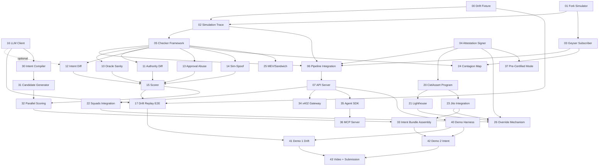

# Ciel Implementation Docs Index

This folder decomposes the Ciel technical specification into per-unit implementation docs. The authoritative source is [`../ciel-technical-spec.md`](../ciel-technical-spec.md) — these docs are a navigation and execution layer over it.

## How to use these docs

Each unit doc is a self-contained execution contract: it tells you what to build, links to the main spec for full detail, declares its dependencies, and includes a copy-pasteable prompt at the bottom for a fresh Claude Code session.

To build a unit:
1. Open the unit doc
2. Read the Overview, Technical Specifications, Key Capabilities, and Dependencies sections
3. Copy the "Prompt for Claude Code" block at the bottom
4. Paste into a fresh Claude Code session
5. The session will read the linked main spec sections and build the unit

## Build order

### Week 1 — Foundation
- [`00-drift-exploit-fixture.md`](./00-drift-exploit-fixture.md) — Capture and verify the Drift exploit transaction + accounts as a replayable test fixture
- [`01-fork-simulator.md`](./01-fork-simulator.md) — Surfpool/LiteSVM integration with lazy mainnet forking and account hot-swap
- [`02-simulation-trace.md`](./02-simulation-trace.md) — Execute transactions in the fork, capture balance deltas, CPI graph, and account changes into a SimulationTrace struct
- [`03-geyser-subscriber.md`](./03-geyser-subscriber.md) — Helius LaserStream gRPC subscriber with account cache, reconnection, and gap-fill
- [`04-attestation-signer.md`](./04-attestation-signer.md) — CielAttestation Borsh schema, Ed25519 signing, and signature verification
- [`05-checker-framework.md`](./05-checker-framework.md) — Checker trait, parallel fan-out with tokio::join_all, 80ms deadline, stub checkers
- [`06-pipeline-integration.md`](./06-pipeline-integration.md) — Wire fork sim + checkers + scorer + signer into a single verdict pipeline
- [`07-api-server.md`](./07-api-server.md) — axum/tonic API server accepting POST /v1/verdict and returning signed attestations

### Week 2 — Risk Graph
- [`10-oracle-sanity-checker.md`](./10-oracle-sanity-checker.md) — Switchboard + Pyth cross-reference oracle sanity checker
- [`11-authority-diff-checker.md`](./11-authority-diff-checker.md) — CPI graph parser detecting hidden SetAuthority/Upgrade/CloseAccount
- [`12-intent-diff-checker.md`](./12-intent-diff-checker.md) — Deterministic balance-delta intent verification with LLM metadata enrichment
- [`13-approval-abuse-checker.md`](./13-approval-abuse-checker.md) — Unlimited token approval detection against known-good program registry
- [`14-sim-spoof-checker.md`](./14-sim-spoof-checker.md) — Pattern-based simulation spoofing detection (v1)
- [`15-scorer.md`](./15-scorer.md) — safety_score and optimality_score computation, verdict thresholds, candidate ranking
- [`16-llm-client.md`](./16-llm-client.md) — Groq/Fireworks async HTTP client for rationale aggregation and intent compilation
- [`17-drift-replay-e2e.md`](./17-drift-replay-e2e.md) — End-to-end Drift exploit replay producing BLOCK verdict through full pipeline

### Week 3 — Enforcement + Design Partner
- [`20-ciel-assert-program.md`](./20-ciel-assert-program.md) — On-chain Solana program: Ed25519 attestation verification via instruction sysvar
- [`21-lighthouse-integration.md`](./21-lighthouse-integration.md) — Lighthouse guard instruction integration with CielAssert + state assertions
- [`22-squads-integration.md`](./22-squads-integration.md) — Squads v4 policy gate: Ciel key as multisig member with time_lock
- [`23-jito-integration.md`](./23-jito-integration.md) — Jito bundle assembly with attestation verification as tx[0]
- [`24-contagion-map-checker.md`](./24-contagion-map-checker.md) — Protocol dependency graph + anomaly detection checker
- [`25-mev-sandwich-checker.md`](./25-mev-sandwich-checker.md) — MEV/sandwich vulnerability detection via slippage analysis
- [`26-override-mechanism.md`](./26-override-mechanism.md) — BLOCK verdict override with time delay, on-chain recording, training data pipeline

### Week 4 — Intent Layer + Monetization
- [`30-intent-compiler.md`](./30-intent-compiler.md) — NL-to-structured-intent compiler via Groq LLM
- [`31-candidate-generator.md`](./31-candidate-generator.md) — Jupiter API integration for generating candidate execution plans
- [`32-parallel-scoring.md`](./32-parallel-scoring.md) — Parallel candidate scoring with optimality x safety_multiplier ranking
- [`33-intent-bundle-assembly.md`](./33-intent-bundle-assembly.md) — Jito bundle assembly for the winning intent candidate
- [`34-x402-gateway.md`](./34-x402-gateway.md) — x402 Express middleware for per-verdict USDC micropayments
- [`35-agent-sdk.md`](./35-agent-sdk.md) — Rust + TypeScript client libraries for the Ciel verdict API
- [`36-mcp-server.md`](./36-mcp-server.md) — MCP tool server exposing ciel_evaluate to MCP-compatible agents
- [`37-pre-certified-mode.md`](./37-pre-certified-mode.md) — Policy template pre-signing and <20ms fast-path verification

### Week 5 — Demos + Submission
- [`40-demo-harness.md`](./40-demo-harness.md) — CLI demo tool with pipeline visualization, timing display, and colored output
- [`41-demo1-drift-replay.md`](./41-demo1-drift-replay.md) — Demo 1 script: Drift exploit replay → BLOCK → enforcement rejects
- [`42-demo2-intent-flow.md`](./42-demo2-intent-flow.md) — Demo 2 script: "swap 10k USDC→SOL" intent → parallel scoring → Jito execution
- [`43-video-and-submission.md`](./43-video-and-submission.md) — Pitch video, technical demo video, README, and Colosseum submission

## Dependency graph



## Critical path

The longest dependency chain through the units:

```
01 Fork Simulator → 02 Simulation Trace → 05 Checker Framework → 06 Pipeline Integration → 10-14 Checkers → 15 Scorer → 17 Drift Replay E2E → 41 Demo 1 Drift → 43 Video + Submission
```

This is 9 hops (counting 10-14 as a single parallel step). The critical path runs through the core verdict pipeline — fork simulation to checker execution to pipeline integration to scoring — culminating in the Drift replay demo. Every delay in the fork simulator cascades to the final submission. Unit 06 (Pipeline Integration) is on the critical path because it wires the checkers to the scorer and signer; checkers cannot be end-to-end tested without it.

Secondary critical path (intent flow):
```
01 → 02 → 05 → 06 → 15 Scorer → 32 Parallel Scoring → 33 Intent Bundle → 42 Demo 2 Intent → 43
```
